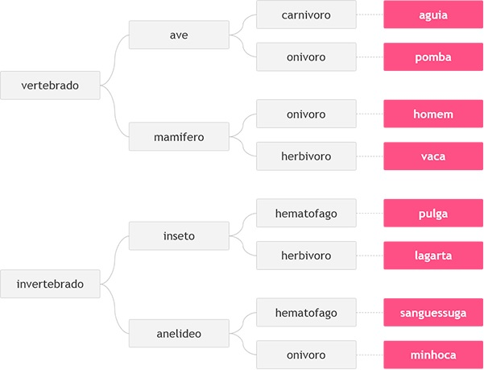

# DESAFIO Animal
Neste problema, você deverá ler 3 palavras que definem o tipo de animal possível segundo o esquema abaixo, da esquerda para a direita.  Em seguida conclua qual dos animais seguintes foi escolhido, através das três palavras fornecidas.

## Entrada
A entrada contém 3 palavras, uma em cada linha, necessárias para identificar o animal segundo a figura acima, com todas as letras minúsculas.

## Saída
Imprima o nome do animal correspondente à entrada fornecida.
 
Exemplos de Entrada	| Exemplos de Saída
--------------------|-------------------
vertebrado          | homem
mamifero            |
onivoro             |

Exemplos de Entrada	| Exemplos de Saída
--------------------|-------------------
vertebrado          |         aguia
ave                 |
carnivoro           |

Exemplos de Entrada	| Exemplos de Saída
--------------------|------------------
invertebrado        | minhoca
anelideo            |
onivoro             |

